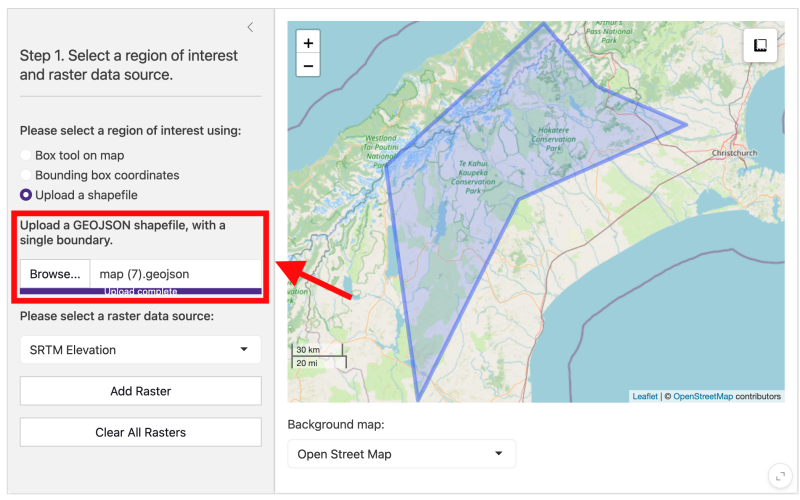
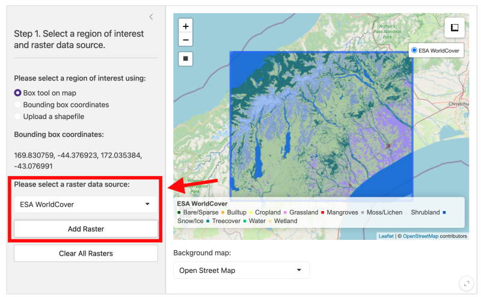
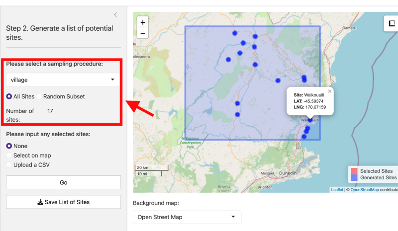
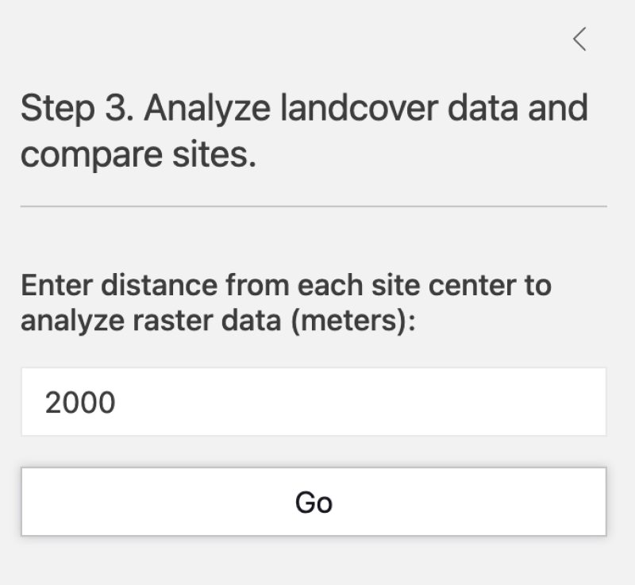
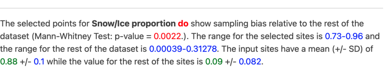
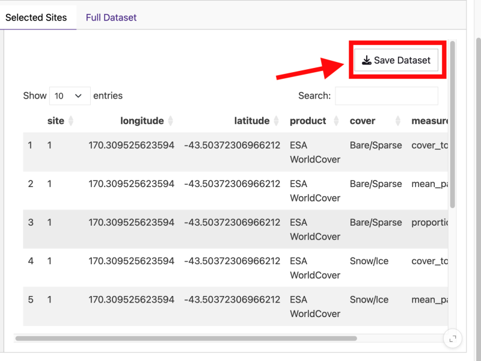

# SiteTool: A tool for quantitative field site selection

<!-- badges: start -->
<!-- badges: end -->


The Site Selection Tool is a R Shiny tool used to assess the land cover
characteristics of potential field sites.

The aim of this tool is to help researchers select sites in a
quantitative way using spatial data. Often, researchers aim to have
field sites that exist along a gradient of different land use types and
characteristics. This tool allows researchers to analyze the land cover
characteristics of a list of sites, and see where potential sites fall
along a gradient of other potential sites.

A ready-to-use browser version is available:
<https://ecosyshealth.shinyapps.io/SiteTool/>.

However, local installation is recommended following the below
instructions.

## Installation

SiteTool is an R based tool. You first need an update-to-date
installation of R (\>= 4; <https://www.r-project.org/>). In an R
interface or RStudio, please enter the following commands to install
sitetool from [GitHub](https://github.com/):

``` r
install.packages("pak")
pak::pak("BioDivHealth/sitetool")
```

## Launching the app

Once the package and dependencies have installed, type the following to
launch the app:

``` r
sitetool::run_app()
```

This will open the tool into in an interactive interface.

## Tutorial

The tool is broken down into three main steps. It is designed so that
you can go back and forth between steps to update your site list.

### Step 1: Select an area interest and type of land cover data

#### Selecting an area of interest

There are three ways to select an area of interest:

1.  **Box Tool**

    Select the box icon located in the upper left-hand corner of the
    map. Use this to select your potential study site area.

    

2.  **Bounding Box Coordinates**

    You may also manually enter the coordinates of your bounding box.
    The map will update based on these bounding box coordinates.
    

3.  **Shapefile**

    You can upload a shapefile covering your area of interest. Please
    ensure shapefiles are in GeoJSON format. The shapefile will be
    displayed once uploaded. A good tool for creating a shapefile for
    your area of interest in <https://geojson.io/>.
    

#### Selecting raster data

Once you have selected an area of interest, you will need to add raster
data related to your selection criteria.

1.  **Default Raster Data**

    Use the drop down menu to select a type of raster data. There are
    three default raster sources: ESA WorldCover, SRTM Elevation, and
    Human Footprint data. Once you have selected a source press **Add
    Raster**. The raster will be displayed on the map when finished.

    

2.  **Upload your own data**

    Select **Upload a file** from the drop down menu. Press **Browse**
    and navigate to the raster on your computer. Uploaded rasters must
    be in GeoTiff format. If your area encompasses multiple tiles,
    please merge before uploading. If you are using a categorical
    raster, make sure there is a color table associated with it for
    correct display. If you are using the browser version, please ensure
    you are using Google Chrome, as it is the only browser that supports
    GeoTiffs. (Note: the browser version only accepts uploads less than
    5 MB, while the local version can accept uploads up to 100 MB).

    

    You can continue adding rasters to cover all of your parameters of
    interests. Please use the map toggle betweeen visualizing the
    different data sources.


### Step 2: Generate a list of sites

#### Generated Sites

You must select a sampling procedure in order to generate a list of
sites. You may also skip this step by leaving sampling procedure as
**None** and only using selected sites (see instructions below).

1.  **Random Sites**

    Sites will be selected based on simple random sampling. Only land
    areas will be selected, and bodies of water will be avoided. You
    must specify the number of sites needed and the distance between the
    sites. You can also specify that sites must be a certain distance
    from a major city and/or major roads.


2.  **Village Sites**

    Village sites will find all of the towns/villages/cities in the
    selected area using OpenStreetMap. You can have the tool find all of
    the villages in an area or randomly select a subset from that
    region. Note that if you select a very large area for village sites,
    the request may time out.



#### Selected Sites

These are your “shortlist” sites that you are considering for the study.
If you don’t have any selected sites yet, you can leave this option as
**None**. Otherwise, there are two options for adding selected sites:

1.  **Select on Map**

    Select this option to toggle a tool that allows you to click on the
    map to add sites to the selected list. Clicked areas will show up as
    red points. If you need to clear the points, please select the
    option below the map.


2.  **Upload a CSV**

    Select this option to upload a list of sites in CSV format. The CSV
    should contain a column labeled **site**, which has the site name,
    and columns with **latitude** and **longitude** in decimal degrees.

### Step 3: Visualize results

In this step, you will analyze the land cover data around each site from
your uploaded rasters.

1.  **Select analysis distance**

    Input the distance from the center of each potential site you would
    like the land cover data analyzed from in meters. This distance is
    the distance from the point to each edge of the raster on all four
    sides, so a distances of 1000 meters (1km) would lead to an area of
    analysis of 4 km<sup>2</sup>.

    

    Press **Go**. The calculations may take a while to run. The plots
    and data will be displayed in the respective tabs when finished.

2.  **Summary Plot**

    The plot shows the values of your input sites relative to the other
    sites analyzed. If you hover over a point, it will show the value
    for that site across of all over the analyzed raster data. . For
    categorical rasters, the proportion of that land cover type found
    within the analysis distance is shown. For continuous rasters, the
    mean value of that measurement is shown within the analysis
    distance.

    

    You can add and remove sites from your “generated” and “selected
    lists. The map will also update. In this example, all snowy sites
    were added to the selected
    sites.

3.  **Statistical Comparison**

    The stats tab indicates whether the selected sites are statistically
    different from the generated sites across land cover values.

    

4.  **Data Tables and Export**

    The data tables contain the results of the analysis for each site
    and can be exported. The following measurement values for
    categorical rasters are included:

    - **Proportion**: proportion covered by each land cover category
      within the analysis range
    - **Mean Patch Area**: the mean patch size for the land cover
      category in the area analyzed. A larger mean patch area indicates
      larger and more contiguous patches of that land cover type.
    - **Total Area (m**<sup>2</sup>): area covered by each land cover
      category within the analysis range

For continuous rasters, the values calculated are mean, min, and max for
the analysis area.

Press the Save Dataset at the top of the table to export the data. You
export just the selected sites or the full dataset depending on which
tab is selected.



## Input Land Cover Data

The app can support categorical land cover rasters such as:

1.  [ESA WorldCover
    Viewer](https://viewer.esa-worldcover.org/worldcover/)
2.  [Dynamic World](https://dynamicworld.app/)
3.  [Copernicus Dynamic Land Cover](https://lcviewer.vito.be/)

This repository has a series of Google Earth Engine scripts to assist
with exporting this data: <https://github.com/BioDivHealth/GEE_Scripts>.
You can also visit the above sites to download a raster for your region
of interest. If your region covers multiple tiles, please merge tiles
into one file prior to uploading. Please ensure the raster CRS is WGS
84, and the values for any land cover type are in one layer following
the numeric codes for the above products.

The app can also support rasters with continuous values, such as for
temperature, NDVI, or elevation. For these inputs, please ensure the
input raster has only one numeric layer.

It is recommended to use high-resolution products (\< 100m) due to the
scale of the analysis.

## Questions or Issues

If you have any questions, encounter a problem, or would like to suggest
improvements:

- 🐛 **Report a bug:** [Open an
  issue](https://github.com/BioDivHealth/sitetool/issues)
- 💡 **Suggest a feature:** [Start a
  discussion](https://github.com/BioDivHealth/sitetool/discussions)
